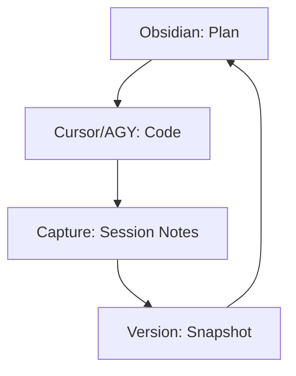
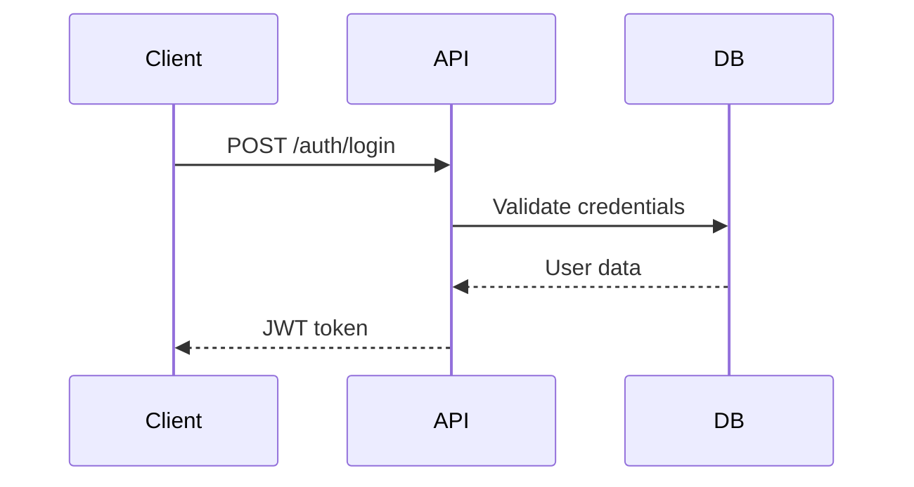

# Obsidian Formatting Reference

Standards for generating Obsidian-compatible markdown notes.

## Table of Contents

1. [YAML Frontmatter](#yaml-frontmatter)
2. [Wikilinks](#wikilinks)
3. [Tags](#tags)
4. [Dataview Compatibility](#dataview-compatibility)
5. [Callouts](#callouts)
6. [Mermaid Diagrams](#mermaid-diagrams)

---

## YAML Frontmatter

Every generated note must include frontmatter. Standard fields:

```yaml
---
type: session-log | runbook | decision | version-snapshot | project
project: "[[Project Name]]"      # Always use wikilink format
date: 2026-02-02                  # ISO 8601
tags:
  - vibe-coding
  - session-log
---
```

**Rules:**
- Always wrap wikilinks in quotes inside frontmatter
- Use ISO dates (YYYY-MM-DD)
- Tags as YAML arrays, not inline `#tags`
- Keep frontmatter fields consistent across note types

### Type-Specific Fields

| Note Type | Extra Fields |
|-----------|-------------|
| session-log | `session` (int), `tools` (array) |
| runbook | `version` (string) |
| decision | `status` (accepted/proposed/deprecated) |
| version-snapshot | `version` (string) |

---

## Wikilinks

Use Obsidian wikilinks for all internal references:

```markdown
See [[Project Name]] for details.
Related to [[Session-001]] and [[ADR-003]].
Documented in [[Runbook-v1.0]].
```

**In frontmatter:** Always quote: `project: "[[Name]]"`

**In body:** No quotes needed: `See [[Name]]`

**With display text:** `[[Session-001|the first session]]`

**To headers:** `[[Session-001#Decisions Made]]`

---

## Tags

Use YAML frontmatter arrays, not inline hashtags:

```yaml
# ✅ Correct
tags:
  - vibe-coding
  - session-log

# ❌ Avoid
tags: #vibe-coding #session-log
```

### Standard Tag Taxonomy

| Category | Tags |
|----------|------|
| Type | `session-log`, `runbook`, `decision`, `version`, `project` |
| Workflow | `vibe-coding`, `planning`, `capture` |
| Status | `in-progress`, `completed`, `archived` |
| Priority | `urgent`, `milestone` |
| Tool | `cursor`, `antigravity`, `vscode` |

---

## Dataview Compatibility

Structure notes for Dataview queries by using consistent frontmatter fields.

### Table Queries

```markdown
```dataview
TABLE date, session as "#", tools
FROM "Projects/MyProject/Sessions"
WHERE type = "session-log"
SORT date DESC
LIMIT 10
```
```

### Task Queries

Use standard checkboxes that Dataview can query:

```markdown
## Tech Debt
- [ ] Refactor auth module
- [ ] Add error handling to API calls
- [x] Fix timezone bug
```

Query:
```markdown
```dataview
TASK
FROM "Projects/MyProject"
WHERE !completed
GROUP BY file.name
```
```

### Inline Fields

For queryable data within note bodies:

```markdown
Duration:: 3 hours
Commits:: 12
LOC Changed:: 450
```

Query: `TABLE duration, commits FROM "Projects/MyProject/Sessions"`

---

## Callouts

Use Obsidian callouts for important information:

```markdown
> [!warning] Breaking Change
> The API endpoint has moved from /v1 to /v2

> [!tip] Effective Prompt
> "Refactor the auth middleware to use JWT tokens, keeping backward compatibility"

> [!bug] Known Issue
> Session timeout doesn't properly clear the cache

> [!success] Milestone
> v1.0 shipped to production
```

### Custom Callout Types for Vibe Coding

```markdown
> [!prompt] Prompt That Worked
> "Create a responsive dashboard with..."

> [!decision] Architecture Decision
> Chose Prisma over Drizzle because...

> [!debt] Tech Debt
> The caching layer needs refactoring after v2
```

---

## Mermaid Diagrams

For architecture documentation, use Mermaid in code blocks:

```markdown

```

### Sequence Diagrams for API Flows

```markdown

```

These render natively in Obsidian's preview mode.
