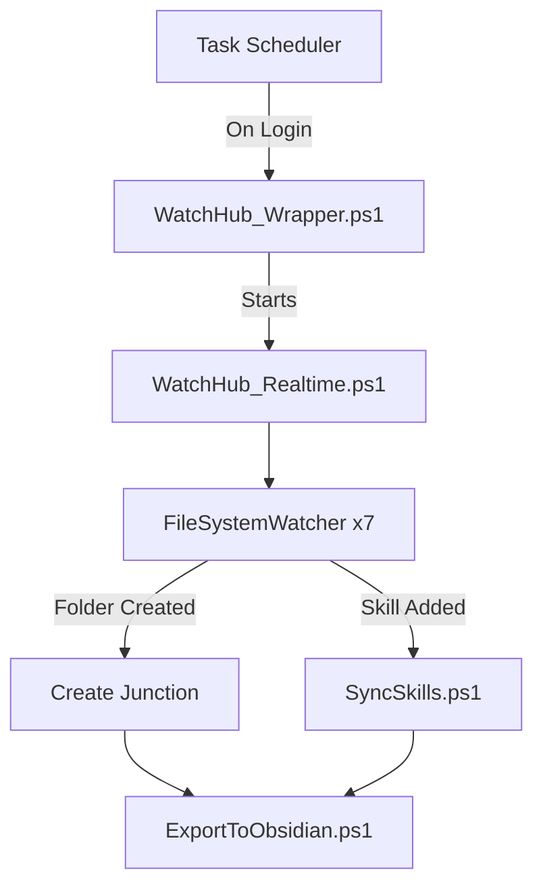

# AI Hub Runbook

> [!info] Overview
> Centralized hub for 50+ AI agent configurations with real-time monitoring of new AI tool installations and skill synchronization across all agents.

## Quick Reference

| Command | Description |
|---------|-------------|
| `.\Hub.ps1` | Interactive control panel |
| `.\Hub.ps1 watch` | Start WatchHub manually |
| `.\Hub.ps1 sync` | Sync skills from Claude |
| `.\WatchHub_Realtime.ps1 -Debug` | Run with debug logging |

---

## Architecture



### Three Layers

| Layer | Script | Role |
|-------|--------|------|
| 1. Auto-Start | Task Scheduler | Launches on login, hidden, auto-restarts |
| 2. Error Handler | `WatchHub_Wrapper.ps1` | Retry logic (5x), error popups, logging |
| 3. Core Monitor | `WatchHub_Realtime.ps1` | 7 FileSystemWatchers, event handling |

---

## Monitored Locations

| Location | Path | Pattern | Junction Suffix |
|----------|------|---------|-----------------|
| UserHome | `C:\Users\YC` | `^\.` (dot files) | `_User_Dot` |
| AppDataRoaming | `AppData\Roaming` | `.*` | `_AppData_Roaming` |
| AppDataLocal | `AppData\Local` | `.*` | `_AppData_Local` |
| Programs | `Local\Programs` | `.*` | `_AppData_Local` |
| GitHubRepo | `GitHubRepo` | `.*` | `_Projects_GitHubRepo` |
| RootDot | `C:\` | `^\.` (dot files) | `_Root_Dot` |
| Skills | `.claude\skills` | `*` | *(symlinks)* |

### AI Keywords
> [!note] Folder Detection
> Folders matching these keywords are auto-linked:
> `claude`, `cursor`, `zed`, `ollama`, `gemini`, `windsurf`, `mcp`, `anthropic`, `openai`, `copilot`, `codeium`, `tabnine`, `github`, `llm`, `ai`, `gpt`, `chatbot`, `agent`, `aider`, `continue`, `cody`, `supermaven`

---

## Concurrency Protection

> [!success] Thread-Safe Operations
> All junction/skill operations are protected by a global mutex to prevent conflicts from simultaneous events.

| Layer | Protection | Purpose |
|-------|-----------|---------|
| **Debouncing** | 2s dedup window | Prevents same event firing multiple times |
| **Duplicate Detection** | Check existing junctions | Prevents duplicate links to same target |
| **Mutex Locking** | Global lock | Serializes concurrent operations |

### How It Works

```
Event 1: .ollama folder created
  ↓
Debounce check → First time, proceed
  ↓
Acquire mutex (10s timeout) → LOCKED
  ↓
Check for duplicates → None found
  ↓
Create junction → Success
  ↓
Release mutex → UNLOCKED

Event 2: .cursor folder created (simultaneous)
  ↓
Debounce check → First time, proceed
  ↓
Try acquire mutex → WAITS (Event 1 has lock)
  ↓
Event 1 finishes, releases mutex
  ↓
Acquire mutex → LOCKED
  ↓
Create junction → Success (no conflict)
  ↓
Release mutex
```

**Mutex Details:**
- Name: `Global\AI_HubWatch_Mutex`
- Timeout: 10 seconds max wait
- Scope: All junction create/delete and skill sync operations
- Auto-release: `try/finally` ensures mutex always released

---

## Event Flows

### New AI Tool Installed
```
Installer creates .newtool/
    ↓
FileSystemWatcher detects
    ↓
Debounce check (2s window)
    ↓
Matches AI keyword? → Yes
    ↓
Acquire mutex lock
    ↓
Check for duplicate junction
    ↓
cmd /c mklink /J "AI_hub\newtool_User_Dot" ".newtool"
    ↓
Release mutex lock
    ↓
Log: _Change_log/newtool_User_Dot_add.txt
    ↓
ExportToObsidian.ps1
```

### Skill Added to Claude
```
npx skills add my-skill
    ↓
Skills watcher detects
    ↓
SyncSkills.ps1 -SkillName "my-skill"
    ↓
Creates symlinks to ALL agents with skills/ folder
    ↓
Log: _Change_log/my-skill_skill_add.txt
```

---

## File Structure

```
C:\Users\YC\AI_hub\
├── Core Scripts
│   ├── WatchHub_Realtime.ps1    # Main monitor (v3)
│   ├── WatchHub_Wrapper.ps1     # Error handler
│   └── SetupAutoStart_Final.ps1 # Install/uninstall
│
├── Automation
│   ├── SyncSkills.ps1           # Skill propagation
│   ├── ExportToObsidian.ps1     # Inventory generator
│   └── TrackInstallation.ps1    # Before/after snapshots
│
├── Utilities
│   ├── Hub.ps1                  # Control panel
│   ├── ShowConfigs.ps1          # List configs
│   └── ShowSkills.ps1           # Skill distribution
│
├── _Change_log/                 # Event logs
│   ├── *_add.txt                # Additions
│   ├── *_del.txt                # Deletions
│   ├── ERROR_*.log              # Errors
│   └── DEBUG_*.log              # Debug (v3)
│
└── Agent Junctions (50+)
    ├── Claude_User_Dot/         # Master for skills
    ├── Cursor_User_Dot/
    └── ...
```

---

## Management Commands

### Task Scheduler
```powershell
# Check status
Get-ScheduledTask -TaskName "AI_HubWatch_AutoMonitor"

# Stop
Stop-ScheduledTask -TaskName "AI_HubWatch_AutoMonitor"

# Start
Start-ScheduledTask -TaskName "AI_HubWatch_AutoMonitor"

# Reinstall
.\SetupAutoStart_Final.ps1 -Remove
.\SetupAutoStart_Final.ps1
```

### Skills Management
```powershell
# Sync all skills from Claude to other agents
.\SyncSkills.ps1

# Sync specific skill
.\SyncSkills.ps1 -SkillName "excel-editor"

# Remove skill from all agents
.\SyncSkills.ps1 -SkillName "old-skill" -Delete
```

### Log Inspection
```powershell
# Recent errors
ls _Change_log/ERROR_*.log | Sort-Object -Descending | Select -First 1

# Watch debug log live (v3)
Get-Content "_Change_log/DEBUG_$(Get-Date -Format 'yyyyMMdd').log" -Wait -Tail 20

# Find debounced events
Select-String "DEBOUNCE" "_Change_log/DEBUG_*.log"
```

---

## Troubleshooting

> [!warning] WatchHub Not Running
> ```powershell
> # Check process
> Get-Process | Where-Object {$_.CommandLine -like "*WatchHub*"}
>
> # Check task
> Get-ScheduledTask -TaskName "AI_HubWatch_AutoMonitor"
>
> # Check errors
> cat (ls _Change_log/ERROR_*.log | Sort -Desc | Select -First 1)
> ```

> [!warning] New Tool Not Detected
> 1. Folder name must contain an AI keyword
> 2. Must be in a monitored location
> 3. Manual fallback:
> ```powershell
> cmd /c mklink /J "C:\Users\YC\AI_hub\toolname_User_Dot" "C:\path\to\.toolname"
> ```

> [!warning] Skills Not Syncing
> ```powershell
> # Verify skills folder exists
> Test-Path "C:\Users\YC\AI_hub\Claude_User_Dot\skills"
>
> # Manual sync
> .\SyncSkills.ps1
>
> # Debug mode
> .\WatchHub_Realtime.ps1 -Debug
> ```

> [!warning] Mutex Timeout
> If you see `[!] Mutex timeout - skipping`:
> 1. Another operation is taking >10s (rare)
> 2. Check debug log for long-running operations
> 3. Restart WatchHub if persistent
> ```powershell
> # Check for mutex timeouts
> Select-String "Mutex timeout" "_Change_log/DEBUG_*.log"
>
> # Restart WatchHub
> Stop-ScheduledTask -TaskName "AI_HubWatch_AutoMonitor"
> Start-ScheduledTask -TaskName "AI_HubWatch_AutoMonitor"
> ```

---

## Important Notes

> [!info] Log Folder
> Event logs are stored in `_Change_log/` containing additions, deletions, errors, and debug logs.

> [!tip] Skills Source of Truth
> - **Master:** `Claude_User_Dot/skills/`
> - All other agents have symlinks pointing to Claude
> - Edit skills in Claude only; changes propagate automatically

> [!info] Junctions vs Symlinks
> - **Junctions** (`/J`): For AI tool directories
> - **Symlinks** (`/D`): For skills folders
> - Junctions work without admin; symlinks may require it

> [!success] Concurrency Safe
> - All operations protected by global mutex
> - Multiple simultaneous installs won't conflict
> - 10-second timeout prevents deadlocks
> - Debug mode logs `[MUTEX]` acquire/release

---

## Version History

### v3.0 (2026-02-01)
- **Debouncing**: 2-second dedup window prevents duplicate events
- **Duplicate detection**: Checks existing junctions before creating
- **Efficient idle**: 30s sleep intervals (30x fewer CPU wake-ups)
- **Debug logging**: `-Debug` flag logs to `DEBUG_YYYYMMDD.log`
- **Mutex locking**: Thread-safe operations prevent concurrent conflicts

### v2.0 (2026-02-01)
- Real-time monitoring (6 locations + skills)
- Deletion detection & junction cleanup
- Skills auto-sync via symlinks
- Smart error logging (silent unless error)
- Auto-retry on errors (5 attempts)

---

## Status

| Metric | Value |
|--------|-------|
| Status | Active |
| Auto-Start | Enabled |
| Memory | ~70-100 MB |
| Agents | 50+ |
| Watchers | 7 |

---

## Related
- [[AI_Hub_Inventory_AUTO]] - Auto-generated inventory
- [[Claude Skills]] - Skills documentation
- `C:\Users\YC\AI_hub\.claude` - Technical reference
