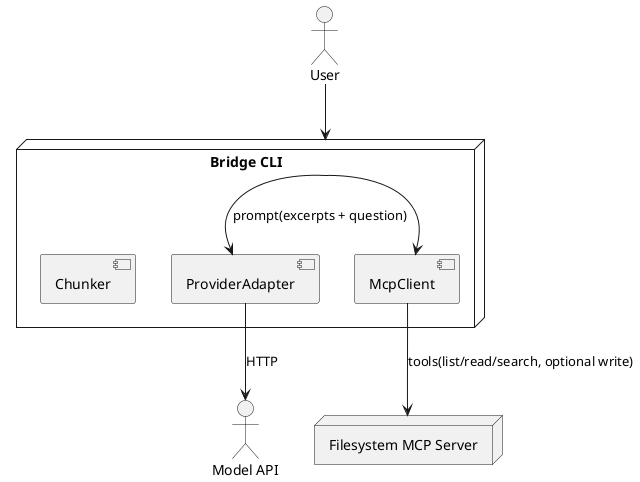

# SPEC-1-Obsidian Vault Q&A Bridge

## Background

You want Claude-like MCP-style access to a private knowledge base, but targeting an Obsidian vault instead of a public API like OP.GG. The goal is to let an LLM (ChatGPT or Perplexity) answer questions and take light actions using the vault’s Markdown files (including frontmatter, links/backlinks, and attachments) while preserving privacy and minimizing setup friction. We’ll explore two families of integrations:

- **Direct API/Action bridge** — expose the vault through a lightweight local HTTP API and allow the LLM to call it (e.g., ChatGPT Actions) to search, read, and optionally write notes.
- **Retrieval-first bridge** — keep a continuously synced embedding index of the vault and let the LLM use retrieval/file-search tools to ground answers in the notes content, with optional deep-links back to Obsidian.

Assumptions (edit as needed):
- Vault contents are primarily Markdown with YAML frontmatter; binary assets (PDFs/images) are secondary.
- Read-only is acceptable for v1; writes (creating/editing notes) are a stretch goal.
- Running a small local service (Node/Python) alongside Obsidian is acceptable.
- Cross-platform target: macOS and Windows.


## Requirements

**Assumptions**: Start with filesystem-only MCP (no Obsidian REST), read-only first; Windows primary, macOS/Linux later; single-vault folder allowlisted.

**MoSCoW**
- **Must**
  - Run a local **filesystem MCP server** scoped to a chosen folder.
  - Provide a **bridge CLI** that: connects to MCP, gathers Markdown context recursively, and queries a **pluggable model** (Perplexity API, Ollama local, or Grok).
  - Support **tooling surface** for: `list_directory`, `read_file`, `search_files` (read-only v1).
  - Enforce **path allowlist** + size limits and log every operation.
  - Run cross‑platform with minimal changes (Windows first).
- **Should**
  - Add guarded **write ops**: `write_file`, `move_file` (soft‑delete to `_Trash/`), `create_directory` with confirmations.
  - Add a **model/provider selector** (env vars or CLI flags) and a **profile** for each provider.
  - Add a simple **file watcher** to auto-refresh the small in‑memory index.
- **Could**
  - Add Obsidian‑specific features later via an **Obsidian REST → MCP** wrapper (backlinks, daily notes).
  - Provide a minimal **TUI** (terminal UI) for selecting model/provider and browsing matches.
- **Won’t (v1)**
  - Hard deletes; multi‑vault multiplexing; remote exposure of the server.

## Method

### Overall workflow (filesystem‑first)
1. **Start MCP server** (filesystem) pointed at the vault copy folder.
2. **Bridge** connects over stdio, exposes a **provider adapter** (Perplexity/Ollama/Grok) and a **tool adapter** (read/search; optional write with confirm).
3. **Query flow**: user runs `bridge ... "question"` → bridge searches & selects file chunks → builds prompt → calls selected model → prints grounded answer.

### Provider adapters (selection)
- **Perplexity**: `--provider pplx` uses `PPLX_API_KEY`, endpoint `/chat/completions`.
- **Ollama** (local): `--provider ollama` uses `OLLAMA_HOST`, endpoint `/api/generate`.
- **Grok**: `--provider grok` uses `XAI_API_KEY`, OpenAI‑compatible chat endpoint.

### CLI surface (v1)
```
bridge --root <folder> \
       --provider <pplx|ollama|grok> \
       --model <model-name> \
       --mode <read|write> \
       --max-files 50 --max-bytes 200000 \
       "Your question here"
```

### Safety gates
- All paths must be under `--root`.
- `--mode write` prompts for **Y/N** per operation; soft‑delete via `move_file` to `_Trash/`.
- Operation log written to `./bridge.log`.

### Minimal architecture (PlantUML)


### Data structures
- **Config**: `{ root, provider, model, maxFiles, maxBytes, mode }`
- **Chunk**: `{ path, excerpt, score }`
- **OpLog**: `{ ts, op, path, args, ok, err }`

### Read algorithm (v1)
1. `list_directory` recursively; filter `*.md`; exclude `node_modules/.git/.obsidian`.
2. `search_files` for query terms to rank; otherwise fallback to first N files.
3. `read_file`/`read_text_file`; chunk by headings; cap by `maxBytes` and context size.
4. Build prompt: **system** (“answer only from excerpts”) + **user** (question + excerpts).
5. Call provider adapter; print; write OpLog.

### Write operations (v1.1)
- `create_file(path, text)` → MCP `write_file` (guard: new path only).
- `move_path(from, to)` → MCP `move_file` (guard: both under root).
- `soft_delete(path)` → MCP `move_file(path, root/_Trash/...)`.

